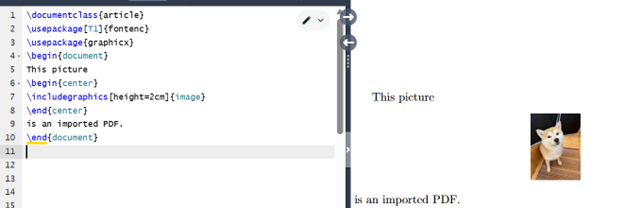
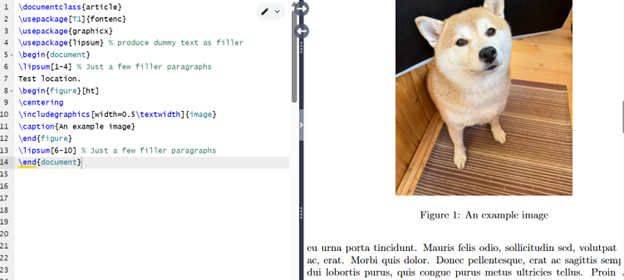
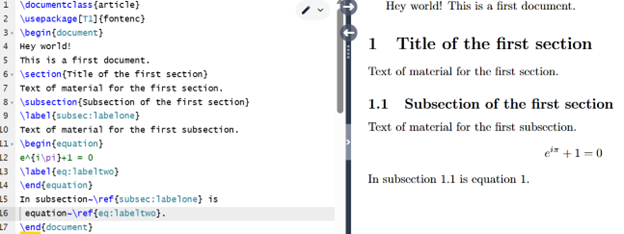

---
## Front matter
lang: ru-RU
title: Практикум по научному письму
author: Савченко Елизавета Николаевна
institute: РУДН, Москва, Россия

date: 20 декабря 2025

## Formatting
## i18n babel
babel-lang: russian
babel-otherlangs: english

## Formatting pdf
toc: false
toc-title: Содержание
slide_level: 2
aspectratio: 169
section-titles: true
theme: metropolis
header-includes:
 - \metroset{progressbar=frametitle,sectionpage=progressbar,numbering=fraction}

---

# Лабораторная работа 4

## Изображения в LaTeX

## Размер изображения 1

## Размер изображения 2

## Изображения в документе

## images float

## images float

## Ссылка

## Гиперссылка

## Выводы

1. Добавил графику из внешнего источника в LaTeX. 
2. Освоил новый графический пакет.
3. Научился оформлять изображения в LaTeX.

## {.standout}

Спасибо за внимание!
