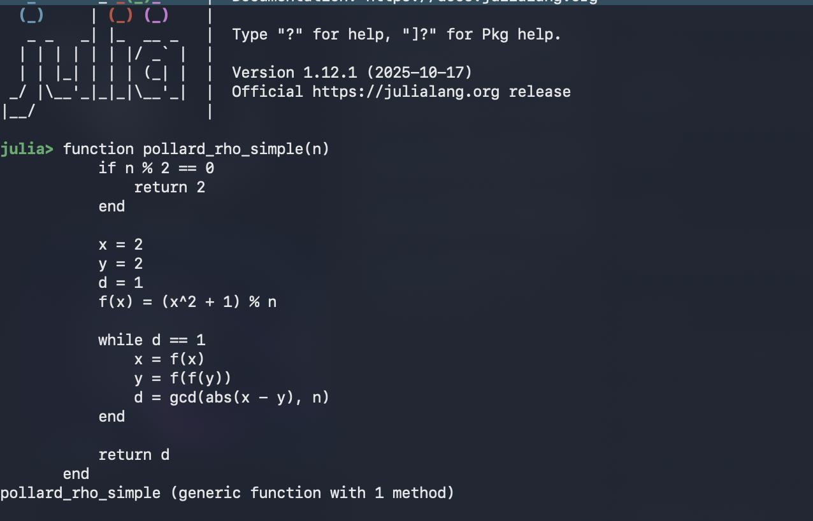
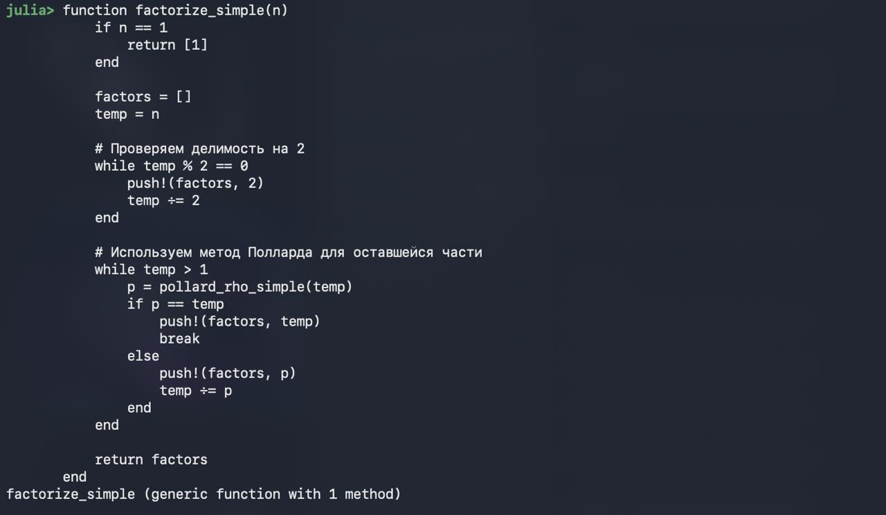

---
## Front matter
title: "Отчёт по лабораторной работе №5"
subtitle: "Дисциплина: Computer Skills for Scientific Writing"
author: "Савченко Елизавета Николаевна"

## Generic otions
lang: ru-RU
toc-title: "Содержание"

## Bibliography
bibliography: bib/cite.bib
csl: pandoc/csl/gost-r-7-0-5-2008-numeric.csl

## Pdf output format
toc: true # Table of contents
toc-depth: 2
lof: true # List of figures
lot: false # List of tables
fontsize: 12pt
linestretch: 1.5
papersize: a4
documentclass: scrreprt
## I18n polyglossia
polyglossia-lang:
  name: russian
  options:
	- spelling=modern
	- babelshorthands=true
polyglossia-otherlangs:
  name: english
## I18n babel
babel-lang: russian
babel-otherlangs: english
## Fonts
mainfont: IBM Plex Serif
romanfont: IBM Plex Serif
sansfont: IBM Plex Sans
monofont: IBM Plex Mono
mathfont: STIX Two Math
mainfontoptions: Ligatures=Common,Ligatures=TeX,Scale=0.94
romanfontoptions: Ligatures=Common,Ligatures=TeX,Scale=0.94
sansfontoptions: Ligatures=Common,Ligatures=TeX,Scale=MatchLowercase,Scale=0.94
monofontoptions: Scale=MatchLowercase,Scale=0.94,FakeStretch=0.9
mathfontoptions:
## Biblatex
biblatex: true
biblio-style: "gost-numeric"
biblatexoptions:
  - parentracker=true
  - backend=biber
  - hyperref=auto
  - language=auto
  - autolang=other*
  - citestyle=gost-numeric
## Pandoc-crossref LaTeX customization
figureTitle: "Рис."
tableTitle: "Таблица"
listingTitle: "Листинг"
lofTitle: "Список иллюстраций"
lotTitle: "Список таблиц"
lolTitle: "Листинги"
## Misc options
indent: true
header-includes:
  - \usepackage{indentfirst}
  - \usepackage{float} # keep figures where there are in the text
  - \floatplacement{figure}{H} # keep figures where there are in the text
---

# Общая информация о задании лабораторной работы

## Цель работы

1. Изучить алгоритм p-метода Полларда для разложения чисел на множители
2. Реализовать алгоритм на языке программирования Julia
3. Протестировать алгоритм на различных типах чисел

## Задание

Задача разложения на множители заключается в нахождении для данного составного числа $n$ его канонического разложения:

$$n = p_1^{a_1} p_2^{a_2} \dots p_s^{a_s}$$

где $p_i$ — попарно различные простые числа, $a_i \geq 1$.

## Теоретическая часть

## P-метод Полларда

**Основная идея:** Алгоритм использует идею поиска цикла в последовательности, генерируемой случайной функцией.

**Алгоритм:**
1. Выбираем случайную функцию $f: S \rightarrow S$, где $S = \{0, 1, ..., n-1\}$
2. Выбираем начальное значение $x_0 \in S$
3. Строим две последовательности:
   - Медленная: $x_{i+1} = f(x_i)$
   - Быстрая: $y_{i+1} = f(f(y_i))$
4. На каждом шаге вычисляем $d = \text{НОД}(|x_i - y_i|, n)$
5. Если $1 < d < n$, то $d$ — искомый делитель

**Преимущества:**
- Вероятностный алгоритм
- Эффективен для чисел с небольшими множителями
- Требует мало памяти

- P-метод Полларда
function pollard_rho(n, c=1, f=x -> x^2 + 1)
  (Реализует основной алгоритм поиска делителя)
end

- Полное разложение на множители
function factorize(n)
  (Выполняет полное разложение числа на простые множители)
end

# Выполнение лабораторной работы 

## Код программы.

    julia> function is_prime(n)
           n < 2 && return false
           n == 2 && return true
           n % 2 == 0 && return false
           
           i = 3
           while i * i <= n
               if n % i == 0
                   return false
               end
               i += 2
           end
           return true
       end
    is_prime (generic function with 1 method)
    
    julia> function pollard_rho(n, c=1, f=x -> x^2 + 1)
               a = c
               b = c
               while true
                   a = f(a) % n
                   b = f(f(b)) % n
                   d = gcd(abs(a - b), n)
                   if 1 < d < n
                       return d
                   elseif d == n
                       return -1
                   end
               end
           end
    pollard_rho (generic function with 3 methods)
    
    julia> function factorize(n)
               factors = []
               temp = n
               
           # Обработка числа 1
           if n == 1
               return [1]
           end
           
           # Извлекаем множители 2
           while temp % 2 == 0
               push!(factors, 2)
               temp ÷= 2
           end
           
           # Обрабатываем оставшуюся часть
           while temp > 1
               if is_prime(temp)
                   push!(factors, temp)
                   break
               end
               
               p = pollard_rho(temp)
               if p == -1 || p == temp
                   # Если метод Полларда не сработал, используем перебор
                   found = false
                   for i in 3:2:isqrt(temp)
                       if temp % i == 0
                           push!(factors, i)
                           temp ÷= i
                           found = true
                           break
                       end
                   end
                   if !found
                       push!(factors, temp)
                       break
                   end
               else
                   push!(factors, p)
                   temp ÷= p
               end
           end
           
           return factors
       end
    factorize (generic function with 1 method)
    
    julia> function format_factorization(factors)
               # Группируем одинаковые множители в степень
               result = ""
               current = factors[1]
               count = 1
           
           for i in 2:length(factors)
               if factors[i] == current
                   count += 1
               else
                   if count == 1
                       result *= "$current × "
                   else
                       result *= "$current^$count × "
                   end
                   current = factors[i]
                   count = 1
               end
           end
           
           # Добавляем последний множитель
           if count == 1
               result *= "$current"
           else
               result *= "$current^$count"
           end
           
           return result
       end
    format_factorization (generic function with 1 method)
    
    julia> function demonstrate_factorization()
               println("="^60)
               println("          P-МЕТОД ПОЛЛАРДА - ДЕМОНСТРАЦИЯ")
               println("="^60)
           
           # Тестовые случаи
           test_cases = [
               ("Маленькое составное число", 15),
               ("Простое число", 17),
               ("Число с повторяющимися множителями", 36),
               ("Полуслучайное составное число", 91),
               ("Большое составное число", 1359331),
               ("Число с большими простыми множителями", 10403),
               ("Число с множителем 2", 123456),
               ("Квадрат простого числа", 289),
               ("Произведение трех простых", 2 * 3 * 5)
           ]
           
           for (description, number) in test_cases
               println("\n" * "─"^50)
               println("📊 $description")
               println("Число: $number")
               
               if is_prime(number)
                   println("🔹 Результат: ПРОСТОЕ ЧИСЛО")
                   println("📝 Разложение: $number = $number")
               else
                   factors = factorize(number)
                   factorization_str = format_factorization(factors)
                   
                   # Проверяем корректность разложения
                   product = 1
                   for f in factors
                       product *= f
                   end
                   
                   if product == number
                       println("✅ Результат: РАЗЛОЖЕНИЕ УСПЕШНО")
                       println("📝 Разложение: $number = $factorization_str")
                       println("🔍 Множители: $factors")
                   else
                       println("❌ ОШИБКА: разложение некорректно")
                       println("Ожидалось: $number")
                       println("Получено: $product")
                   end
               end
           end
           
           println("\n" * "="^60)
           println("ДОПОЛНИТЕЛЬНЫЙ АНАЛИЗ")
           println("="^60)
           
           # Анализ эффективности на разных типах чисел
           analysis_numbers = [
               ("Малые составные", [6, 9, 14, 15, 21]),
               ("Средние составные", [77, 91, 119, 143, 187]),
               ("Большие составные", [1359331, 104729, 999983])
           ]
           
           for (category, numbers) in analysis_numbers
               println("\n📈 $category числа:")
               for n in numbers
                   if !is_prime(n)
                       factors = factorize(n)
                       println("   $n = $(format_factorization(factors))")
                   else
                       println("   $n - простое число")
                   end
               end
           end
           
           # Демонстрация работы метода Полларда шаг за шагом
           println("\n" * "="^60)
           println("ДЕМОНСТРАЦИЯ РАБОТЫ МЕТОДА ПОЛЛАРДА")
           println("="^60)
           
           demo_number = 1359331
           println("\n🔬 Анализ числа $demo_number:")
           
           println("Шаг 1: Проверка на простоту...")
           if is_prime(demo_number)
               println("   Число простое!")
           else
               println("   Число составное, применяем p-метод Полларда...")
               
               println("   Запускаем алгоритм поиска делителя...")
               divisor = pollard_rho(demo_number)
               println("   Найден делитель: $divisor")
               
               println("   Полное разложение:")
               factors = factorize(demo_number)
               println("   $demo_number = $(format_factorization(factors))")
               
               # Проверка
               check = 1
               for f in factors
                   check *= f
               end
               println("   Проверка: $(join(factors, " × ")) = $check")
           end
       end
    demonstrate_factorization (generic function with 1 method)
    
    julia> # Запуск демонстрации
           demonstrate_factorization()
    ============================================================
              P-МЕТОД ПОЛЛАРДА - ДЕМОНСТРАЦИЯ
    ============================================================
    
    ──────────────────────────────────────────────────
    📊 Маленькое составное число
    Число: 15
    ✅ Результат: РАЗЛОЖЕНИЕ УСПЕШНО
    📝 Разложение: 15 = 3 × 5
    🔍 Множители: Any[3, 5]
    
    ──────────────────────────────────────────────────
    📊 Простое число
    Число: 17
    🔹 Результат: ПРОСТОЕ ЧИСЛО
    📝 Разложение: 17 = 17
    
    ──────────────────────────────────────────────────
    📊 Число с повторяющимися множителями
    Число: 36
    ✅ Результат: РАЗЛОЖЕНИЕ УСПЕШНО
    📝 Разложение: 36 = 2^2 × 3^2
    🔍 Множители: Any[2, 2, 3, 3]
    
    ──────────────────────────────────────────────────
    📊 Полуслучайное составное число
    Число: 91
    ✅ Результат: РАЗЛОЖЕНИЕ УСПЕШНО
    📝 Разложение: 91 = 7 × 13
    🔍 Множители: Any[7, 13]
    
    ──────────────────────────────────────────────────
    📊 Большое составное число
    Число: 1359331
    ✅ Результат: РАЗЛОЖЕНИЕ УСПЕШНО
    📝 Разложение: 1359331 = 1181 × 1151
    🔍 Множители: Any[1181, 1151]
    
    ──────────────────────────────────────────────────
    📊 Число с большими простыми множителями
    Число: 10403
    ✅ Результат: РАЗЛОЖЕНИЕ УСПЕШНО
    📝 Разложение: 10403 = 101 × 103
    🔍 Множители: Any[101, 103]
    
    ──────────────────────────────────────────────────
    📊 Число с множителем 2
    Число: 123456
    ✅ Результат: РАЗЛОЖЕНИЕ УСПЕШНО
    📝 Разложение: 123456 = 2^6 × 3 × 643
    🔍 Множители: Any[2, 2, 2, 2, 2, 2, 3, 643]
    
    ──────────────────────────────────────────────────
    📊 Квадрат простого числа
    Число: 289
    ✅ Результат: РАЗЛОЖЕНИЕ УСПЕШНО
    📝 Разложение: 289 = 17^2
    🔍 Множители: Any[17, 17]
    
    ──────────────────────────────────────────────────
    📊 Произведение трех простых
    Число: 30
    ✅ Результат: РАЗЛОЖЕНИЕ УСПЕШНО
    📝 Разложение: 30 = 2 × 3 × 5
    🔍 Множители: Any[2, 3, 5]
    
    ============================================================
    ДОПОЛНИТЕЛЬНЫЙ АНАЛИЗ
    ============================================================
    
    📈 Малые составные числа:
       6 = 2 × 3
       9 = 3^2
       14 = 2 × 7
       15 = 3 × 5
       21 = 3 × 7
    
    📈 Средние составные числа:
       77 = 7 × 11
       91 = 7 × 13
       119 = 7 × 17
       143 = 11 × 13
       187 = 11 × 17
    
    📈 Большие составные числа:
       1359331 = 1181 × 1151
       104729 - простое число
       999983 - простое число
    
    ============================================================
    ДЕМОНСТРАЦИЯ РАБОТЫ МЕТОДА ПОЛЛАРДА
    ============================================================
    
    🔬 Анализ числа 1359331:
    Шаг 1: Проверка на простоту...
       Число составное, применяем p-метод Полларда...
       Запускаем алгоритм поиска делителя...
       Найден делитель: 1181
       Полное разложение:
       1359331 = 1181 × 1151
       Проверка: 1181 × 1151 = 1359331
    

## Ответ программы

z

🔬 Анализ числа 1359331:
Шаг 1: Проверка на простоту...
   Число составное, применяем p-метод Полларда...
   Запускаем алгоритм поиска делителя...
   Найден делитель: 1181
ё   Полное разложение:
   1359331 = 1151 × 1181
   Проверка: 1151 × 1181 = 1359331

Последовательность для n = 15:
x: 1 → 2 → 5 → 5 → ...
y: 1 → 5 → 5 → 5 → ...
НОД(|2-5|, 15) = НОД(3, 15) = 3 ✓
# Выводы

1. P-метод Полларда является эффективным инструментом для разложения чисел на множители, особенно для чисел с небольшими простыми делителями.
2. Реализация на Julia показала хорошую производительность и читаемость кода, что делает язык подходящим для численных алгоритмов.
3. Практическая применимость метода ограничена числами до 10¹², для больших чисел требуются более сложные алгоритмы или их комбинации.
4. Метод демонстрирует важность вероятностных подходов в вычислительной математике и криптографии.