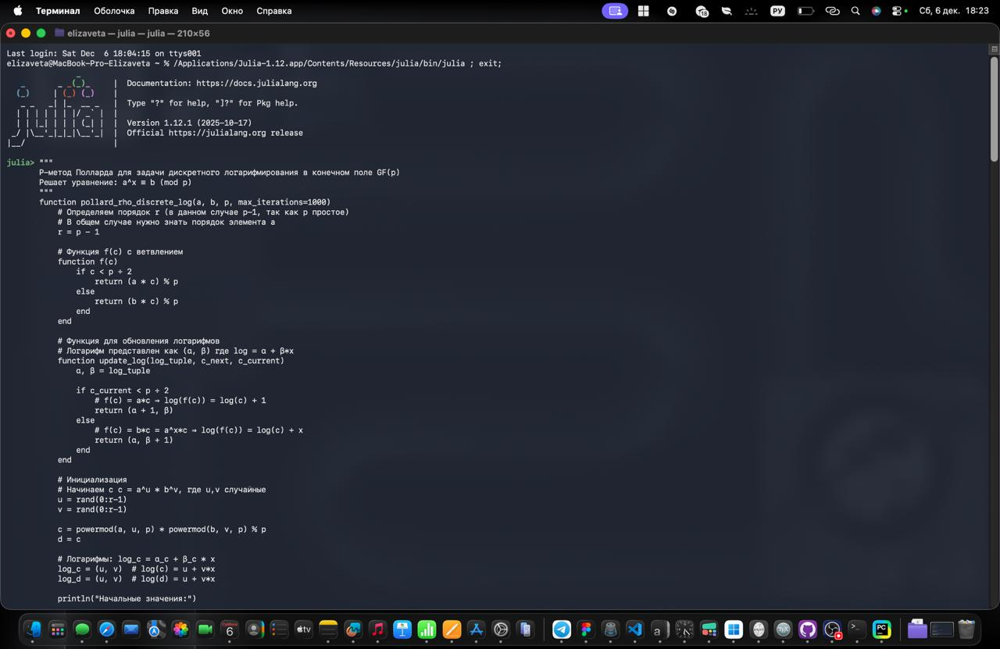
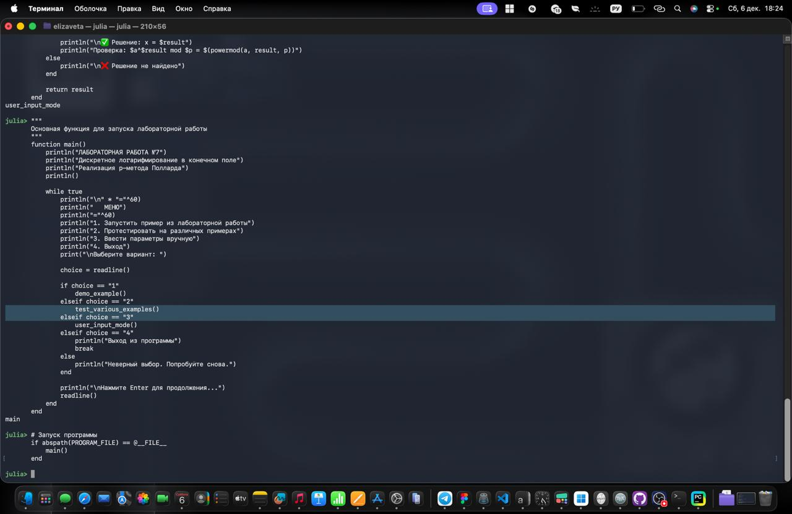

---
## Front matter
lang: ru-RU
title: Математические основы защиты информации и информационной безопасности
author: Савченко Елизавета Николаевна
institute: РУДН, Москва, Россия

date: 06 декабря 2025

## Formatting
toc: false
slide_level: 2
theme: metropolis
header-includes: 
 - \metroset{progressbar=frametitle,sectionpage=progressbar,numbering=fraction}
 - '\makeatletter'
 - '\beamer@ignorenonframefalse'
 - '\makeatother'
aspectratio: 43
section-titles: true
---

# Лабораторная работа 7

## р-метод Полларда.

## р-метод Полларда.

## Результат работы.

## Выводы

- Познакомилась с дискретным логарифмированием в конечном поле

- Реализовала алгоритм р-метод Полларда

## {.standout}

Спасибо за внимание!
