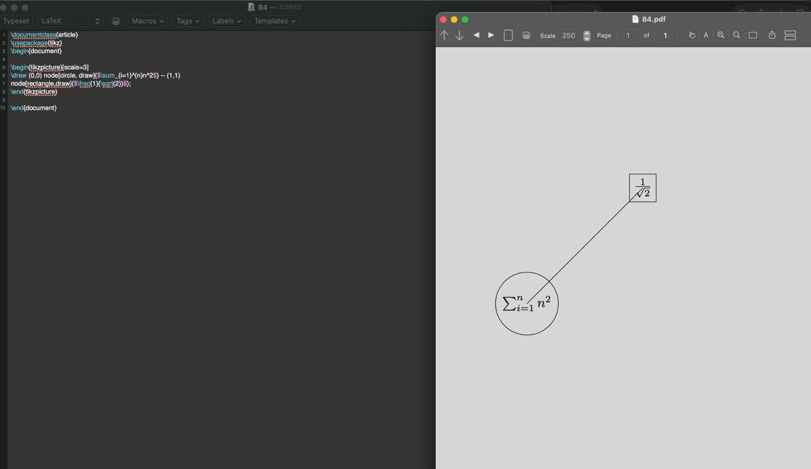
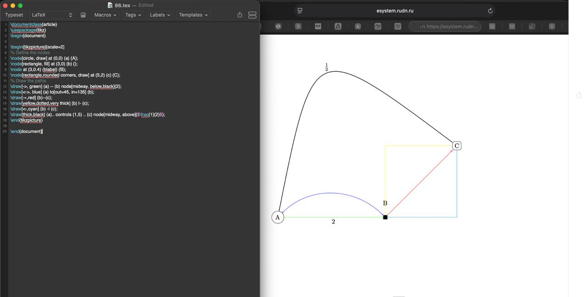

---
# Front matter
lang: ru-RU
title: "Лабораторная работа №8"
subtitle: "Практикум по научному письму"
author: "Савченко Елизавета Николаевна"

## Generic otions
lang: ru-RU
toc-title: "Содержание"

## Bibliography
bibliography: cite.bib
csl: pandoc/csl/gost-r-7-0-5-2008-numeric.csl

## Pdf output format
fontsize: 12pt
linestretch: 1.5
papersize: a4
documentclass: scrreprt
## I18n polyglossia
polyglossia-lang:
  name: russian
  options:
	- spelling=modern
	- babelshorthands=true
polyglossia-otherlangs:
  name: english
## I18n babel
babel-lang: russian
babel-otherlangs: english
## Fonts
mainfont: IBM Plex Serif
romanfont: IBM Plex Serif
sansfont: IBM Plex Sans
monofont: IBM Plex Mono
mathfont: STIX Two Math
mainfontoptions: Ligatures=Common,Ligatures=TeX,Scale=0.94
romanfontoptions: Ligatures=Common,Ligatures=TeX,Scale=0.94
sansfontoptions: Ligatures=Common,Ligatures=TeX,Scale=MatchLowercase,Scale=0.94
monofontoptions: Scale=MatchLowercase,Scale=0.94,FakeStretch=0.9
mathfontoptions:
## Biblatex
biblatex: true
biblio-style: "gost-numeric"
biblatexoptions:
  - parentracker=true
  - backend=biber
  - hyperref=auto
  - language=auto
  - autolang=other*
  - citestyle=gost-numeric
## Pandoc-crossref LaTeX customization
figureTitle: "Рис."
listingTitle: "Листинг"
lofTitle: "Список иллюстраций"
lolTitle: "Листинги"
## Misc options
indent: true
header-includes:
  - \usepackage{indentfirst}
  - \usepackage{float} # keep figures where there are in the text
  - \floatplacement{figure}{H} # keep figures where there are in the text
---

# Цель работы

Познакомиться с языком LaTeX, продолжить изучение его возможностей. 

# Задание

1. Запустить несколько различных программ
2. Изучить новый пакет для работы с графиками.

# Выполнение лабораторной работы

 
График состоит из нескольких точек и линий. Попробуем построить кривую по точкам (рис. [-@fig:001] ) 

 
Помимо рисования прямых линий, мы можем создавать и другие типы линий. (рис. [-@fig:002] )

Мы можем рисовать не только прямые, но и изогнутые линии. (рис. [-@fig:003] ) 

Теперь посмотрим на обозначения, которые мы можем нанести на график. (рис. [-@fig:004] ) 

Узлам также можно присвоить математические формулы, и, как уже было сказано, их можно обвести простой линией. (рис. [-@fig:005] ) 

Попробуем создать сложный график с большим количеством разных элементов (рис. [-@fig:006] ) 

В TikZ также можно использовать циклы for с помощью команды foreach  (рис. [-@fig:007] ) 

# Выводы

Познакомился с языком LaTeX, продолжил изучение его возможностей.

# Список литературы

Лабораторная работа №8
Практикум по научному письму [Электронный ресурс]. URL: https://esystem.rudn.ru/pluginfile.php/2862317/mod_folder/content/0/Practical-scientific-writing.pdf

